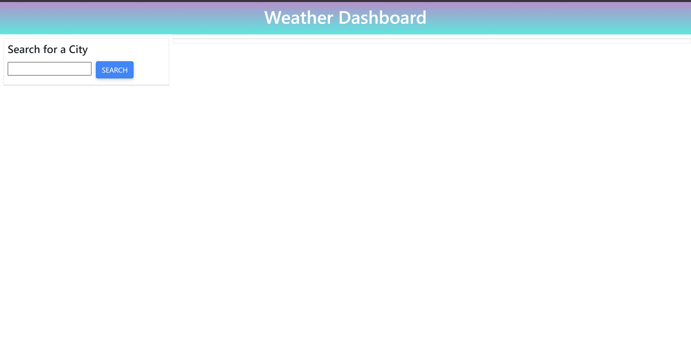
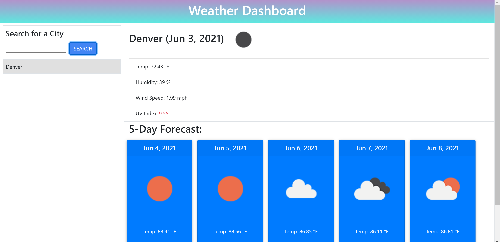

# weather-Dashboard

    
    
    
    

  

    
    
    

## Description

For this assignment, I was tasked with creating a weather dashboard that would pull data from a specific API and display that data on the page, depending on what city the user searched. This assignment helped me to better understand how data is grabbed from whatever source and rendered on the page and how it can then update dynamically (searching for another city). For the basic design, I added a current forecast section and a 5-day upcoming forecast section. This, in turn, will provide the user enough data to help plan their daily outings around the weather.

## Table of Contents 📖

- [Technologies Used](#technologies-used-%EF%B8%8F)
- [Installation](#installation-%EF%B8%8F)
- [Usage Demo](#usage-demo)
- [License](#license-)

## Technologies Used 🖥️

| Technology  | Link                                    |
| ----------- | --------------------------------------- |
| moment.js   | https://momentjs.com/                   |
| jquery      | https://jquery.com/                     |
| Bootstrap   | https://getbootstrap.com/               |
| MDBoostrap  | https://mdbootstrap.com/                |
                

## Installation ⚙️

This application functions off a html and javascript file, as well as bootstrap, jquery, moment.js, and the OpenWeather api. I also utilized mdbootstrap for added animations and color schemes.

## Usage Demo

Here are screenshots of the finished application as well as a link to the website.

---------------------------

Link: https://dkallen117.github.io/weather-Dashboard/

## License 

MIT
